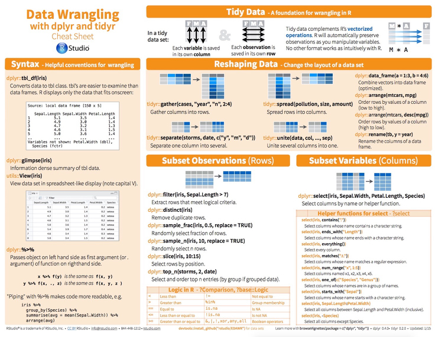
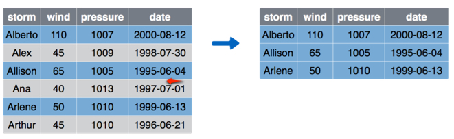

template: inverse
class: middle, center, inverse

# krangl

is a {K}otlin library for data w{rangl}ing.

[https://github.com/holgerbrandl/krangl](https://github.com/holgerbrandl/krangl)

_Holger Brandl_

_6.6.2016 MPI-CBG - BIER_

---

# 90% of Data Science

are just *just* Table Integration

---

# Awesome ways to do it. Part 1

`dplyr` A R grammar for data manipulation

```{r}
flights %>%
    group_by(year, month, day) %>%
    select(year:day, arr_delay, dep_delay) %>%
    summarise(
        mean_arr_delay = mean(arr_delay, na.rm = TRUE),
        mean_dep_delay = mean(dep_delay, na.rm = TRUE)
    ) %>%
    filter(mean_arr_delay > 30 | mean_dep_delay > 30)
```


`dplyr` implements the following 5+1 core verbs useful for data manipulation:

* `select()` retains/removes a subset of variables
* `filter()` retains/removes a subset of rows
* `mutate()` derives new columns
* `arrange()` re-orders the rows in a table
* `summarise()` reduces data to a smaller number of summary statistics
* `group_by()` takes a table and converts it into a _grouped table_ where operations are performed by group

---
## Awesome ways to do it. Part2

Python
* [pandas](http://pandas.pydata.org/) is an open source, BSD-licensed library providing high-performance, easy-to-use data structures and data analysis tools!
* [agate](https://github.com/wireservice/agate): is a Python data analysis library that is optimized for humans instead of machines

Shell
* [csvkit](http://csvkit.readthedocs.io/) is a suite of utilities for converting to and working with CSV, the king of tabular file formats.

SQL
* ... ?

---

## Awesome ways to do it... on the JVM?

[http://stackoverflow.com/questions/20540831/java-object-analogue-to-r-data-frame](http://stackoverflow.com/questions/20540831/java-object-analogue-to-r-data-frame)

[Joinery](https://github.com/cardillo/joinery): Data frames for Java
* Rather clumsy syntax
* Many `dplyr`-verbs are missing and development seems on hold

[Guava Tables](https://github.com/google/guava/wiki/CollectionUtilitiesExplained#tables) ??
```
// use LinkedHashMaps instead of HashMaps
Table<String, Character, Integer> table = Tables.newCustomTable(
  Maps.<String, Map<Character, Integer>>newLinkedHashMap(),
  new Supplier<Map<Character, Integer>> () {
    public Map<Character, Integer> get() {  return Maps.newLinkedHashMap();  }
  });
```

Seriously, What else  ???


---
# Awesome ways to do it. Apache Spark


* huge depedency tree
* just sql
* too much for many applications


### Query execution in Spark

The Catalyst query optimizer creates the physical Execution Plan for DataFrames


---
# Spark Example

```{scala}
val auction = sc.textFile("ebay.csv").map(_.split(",")).map(p =>
Auction(p(0),p(1).toFloat,p(2).toFloat,p(3),p(4).toInt,p(5).toFloat,p(6).toFloat,p(7),p(8).toInt )).toDF()

auction.show()
// auctionid  bid   bidtime  bidder         bidderrate openbid price item daystolive
// 8213034705 95.0  2.927373 jake7870       0          95.0    117.5 xbox 3
// 8213034705 115.0 2.943484 davidbresler2  1          95.0    117.5 xbox 3 …

// How many auctions were held?
auction.select("auctionid").distinct.count
// Long = 627

auction.groupBy("item", "auctionid").count.agg(min("count"), avg("count"),max("count")).show

// MIN(count) AVG(count)        MAX(count)
// 1  16.992025518341308 75

// Get the auctions with closing price > 100
val highprice= auction.filter("price > 100")
// highprice: org.apache.spark.sql.DataFrame = [auctionid: string, bid: float, bidtime: float, bidder: // string, bidderrate: int, openbid: float, price: float, item: string, daystolive: int]

// // How many  bids per auction? register the DataFrame as a temp table
auction.registerTempTable("auction")
sqlContext.sql("SELECT auctionid, item,  count(bid) FROM auction GROUP BY auctionid, item").show()
// auctionid  item    count
// 3016429446 palm    10
// 8211851222 xbox    28. . .
```


---
# Can we do better?

* Pick a javm-langauge that promises to allow for flexible DSL/API design
* Try to mimick
* consistent grammar --> Steal from the best!! --> Steal from `dplyr`

---
# Data Wrangling Cheatsheet

Organized by task.

Informative infographics.

2 pages of condensed awesomeness.




---
## Please welcome: Krangl


> krangl is a {K}otlin library for data w{rangl}ing.

* By implementing a grammar of data manipulation, it allows to filter, aggregate and reshape tabular data.
* More a technology experiment than a libraary for now
* Covers all major `dplyr` verbs


---
## Why `krangl` and not `dplyk` or `kplyr`

* Don't stick too much to R conventions but rather embed into the Kotlin naming
* _He_ likes it


---
##  Select columns with `select()`


Often you work with large datasets with many columns where only a few are actually of interest to you

`select()` breaks down a dataset to just a subset of columns of interest

```{kotlin}
storms.select("storm", "pressure")
```


---

## `select()`'s little helpers


* It provides a powerful selector syntax.

```{kotlin}
flights.select({ range("year", "day") }, { oneOf("arr_delay", "dep_delay") })
```

* It allows for negative selection, ie it can also drop unwanted columns from our data

```{kotlin}
flights.select({ -"dest" } , { -starts_with("arr") }, {-ends_with("time") })
```

Mini-language similar to  `?select` for a more complete overview


---

## Inspect subsets of data with `filter()`


`filter()` allows to select a subset of the rows from a table. The first argument is the name of the data frame, and the second and subsequent are filtering expressions evaluated in the context of that data frame:

Which storms had a wind speed greater than 50?

```{kotlin}
storms.filter { it["wind"] gt 50 }
```



---

## Multiple conditions with `filter()`


* Separate multiple filters with a comma (or `&`)
* To filter with OR use a `|`

How many flights flew to Madison in f January?

```{kotlin}
flights.filter { (it["dest"] eq "MSN")  AND (it["month"] eq 1) }
```


---
## Add new columns with `mutate()`


As well as selecting from the set of existing columns, it's often useful to add new columns that are functions of existing columns.  This is the job of `mutate()`:

What was the speed of the planes?
```{kotlin}
flights.mutate("speed" to { it["distance"]/it["air_time"] * 60 })

```

Biggest limitation of `krangl`: Limited operator [overloading support](https://www.google.de/webhp?sourceid=chrome-instant&ion=1&espv=2&ie=UTF-8#q=operator%20overloading%20kotlin) in Kotlin
* no vectorization
* Designed as such on on purporse to avoid scala-operator mess

---
# Reorder rows with `arrange()`


Sort storms by maximum wind speed

```{r}
storms.arrange("wind")
```

* TBD: Use `desc(wind)` to order a column in descending order
* If more than one column name is provided, each additional column will be used to break ties in the values of preceding columns.


---
# Summarise values with `summarise()`


`summarise()` collapses a table to just a single row.

Applied to grouped data it will collapse each group into one row.

```{kotlin}
flights.summarize(
    "mean_arr_delay" to { it["arr_delay"].mean(removeNA = true) },
    "mean_dep_delay" to { it["dep_delay"].mean(removeNA = true) }
)
```

* Common summary functions are `sum`, `min`, `max`, `mean`, `median`,`var` or `sd`

---
# Grouped operations with `group_by()`


In `krangl`, grouping is its own action. It is done as its own step in the pipeline.

Once data is grouped, `filter`, `mutate` and `summarise` will be applied for each group separately

Calculate mean flight delays for each carrier
```{r}
flightsGrpd  <- group_by(flights, carrier)
summarise(flightsGrpd, delay = mean(dep_delay, na.rm = TRUE))
```


---
# Piping with %>% vs Method chaining?

```{r}
iris %>%
    filter(species=="setosa") %>%
    summarize(mean_sep_length=mean(Sepal.length))
```

Hadely's concern
> Method chaining is more succinct, but only
  the owner of the class can add new methods

However:
Everyone can add methods to a class in Kotlin via [extension fuctions](https://kotlinlang.org/docs/reference/extensions.html#extension-functions)

---
# Extension Functions

To declare an extension function, we need to prefix its name with a _receiver type_, i.e. the type being extended.

```{kotlin}
fun MutableList<Int>.swap(index1: Int, index2: Int) {
  val tmp = this[index1] // 'this' corresponds to the list
  this[index1] = this[index2]
  this[index2] = tmp
}

val l = mutableListOf(1, 2, 3)
l.swap(0, 2)
```
* No new members into a class,  merely make new functions callable with the dot-notation on instances of a class.
* 'this' inside 'swap()' will hold the value of 'l'

---
# How to extend `krangl`?

```{kotlin}
/** Counts observations by group.*/
fun DataFrame.count(vararg selects: String = this.names.toTypedArray(), countName: String = "n"): DataFrame =
        select(*selects).groupBy(*selects).summarize(countName, { nrow })

irisData.count("Species")
```

Also noteworthy
* expression body function implemtation (as compared to java-style block body implementations)
* default arguments

---
# Concept

Conceptually JobList `jl` is just managing lists of job-ids as reported by the underlying queuing system
```
>cat .some_jobs 
860671
860681
860686
860688
860691
```

* Processing states: Did they finish? Exit codes?
* Runtime statistics: How long? How much pending When?
* Stderr/out Logs?
* Metrics?

---
# Benchmarking

* Using flights example grouping, aggregation, filtering)
* dplyr: 20ms
* krangl: 0.34 ± 0.02 SD	, N=25

performance difference: > 100x

However, initial focus: How close can we come to the dplyr API experience when using Kotlin?


---
# Current State & Roadmap

 Let's ask the data wraning sheet again
* better reshape support needed: `gather()` and `separate()` --> easy kotlin api because no lambda


Later or no clue how to do so
* embed interactive table view ???
* Index backend for grouped operations (instead of split-backend as of now)

* some notes

---

# Questions, comments?

Thank you for your attention!


