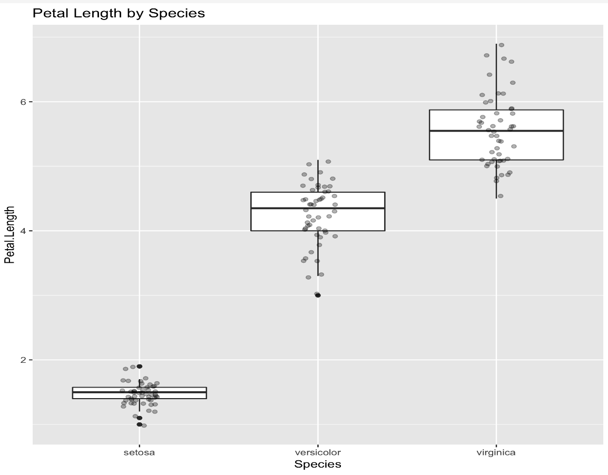

# How to visualize tabular data when using krangl?

We recommend `kravis` fo - https://github.com/holgerbrandl/kravis

`kravis` implements a grammar to create a wide range of plots using a standardized set of verbs.

`kravis` builds on top of `krangl` and `ggplot2` from R. The latter it will access via different backends like a local installation, docker or Rserve.


## Example


```kotlin
import kravis.* 
import krangl.irisData 

irisData.ggplot("Species" to x, "Petal.Length" to y)
    .geomBoxplot()
    .geomPoint(position = PositionJitter(width = 0.1), alpha = 0.3)
    .title("Petal Length by Species")
```




# Other options

There are great other libaries available, which typically don't work with `krangl` yet, but provide awesome ways to visualize data. See [here](https://github.com/holgerbrandl/kravis#references) for a listing.


